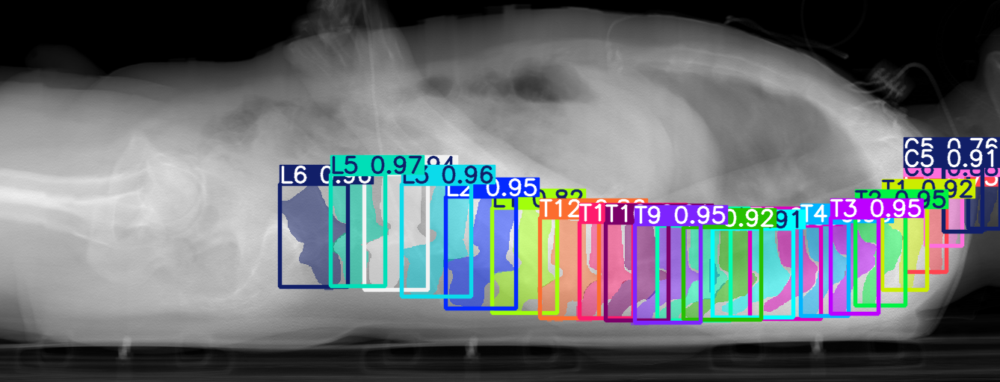
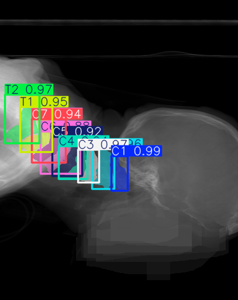
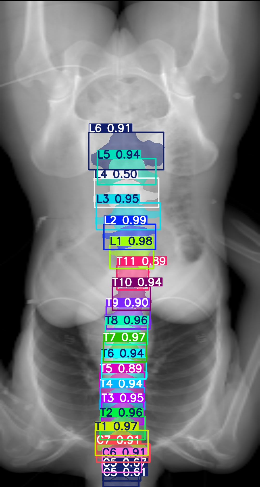
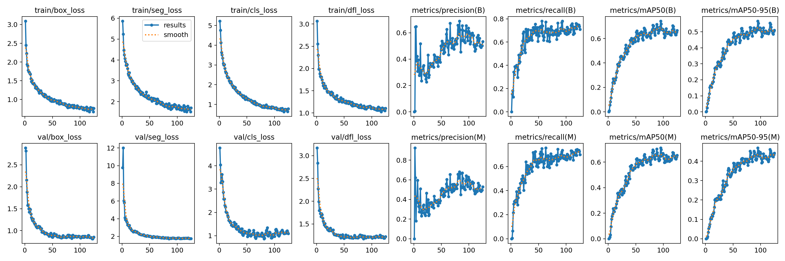
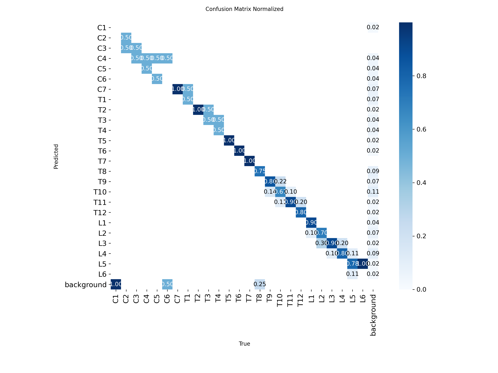
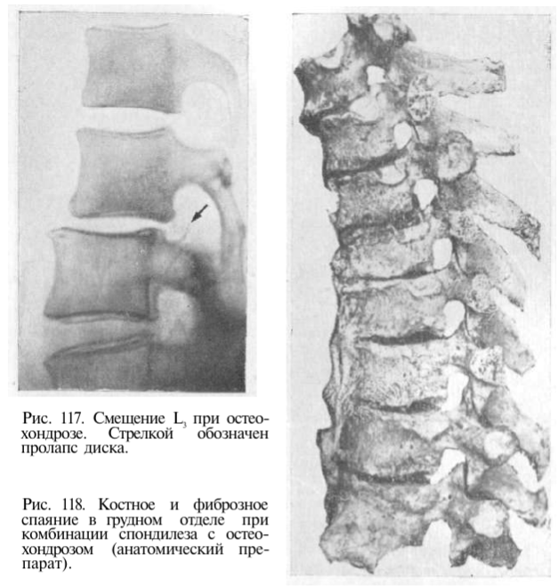
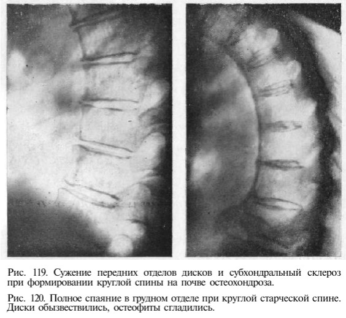
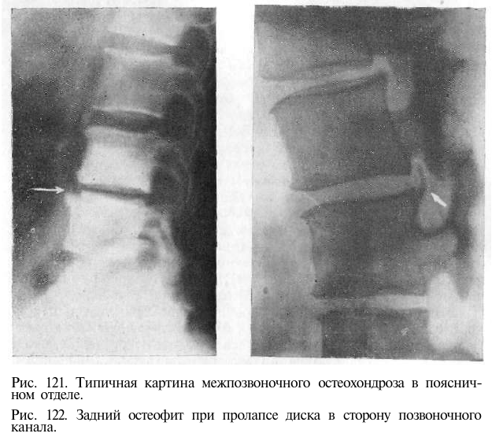

# Отчёт по тестовому заданию: инстанс-сегментации и детекции позвонков, теоретическое изучение патологий позвоночника на примере остеохондроза

## Цель задания
Целью данного задания является проверка ваших практических навыков в области компьютерного зрения, работы с медицинскими данными и способности ксамостоятельному решению комплексных задач. Вы продемонстрируете умение находить и подготавливать данные, обучать современные нейросетевые модели, а также проводить базовый медицинский анализ.

## Описание задачи
Необходимо разработать прототип системы для автоматического анализа рентгеновских снимков позвоночника. Задача системы - инстанс-сегментация, либо детекция позвонков: нахождение на изображении каждого позвонка и определение его порядкового номера (например, C3, T5, L4) для шейного, грудного и поясничного отделов. Помимо выполнения основной задачи также требуется теоретическое изучение и формирование насмотренности по патологиям позвоночника на примере остеохондроза.

## Структура проекта

- **`train.py`** — содержит код для обучения модели инстанс-сегментации на синтетических рентгеновских снимках.  
- **`spine_detector.py`** — минимальный скрипт для инференса: загружает обученную модель и выполняет детекцию и сегментацию позвонков на наборе входных изображений.  
- **`CT_scans_to_X-Ray.py`** — скрипт конвертации КТ-томов в синтетические рентгеновские снимки (DRR) с проекцией по заданным анатомическим осям.  

## Содержание
1. Описание использованного датасета 
2. Обоснование выбора архитектуры модели 
3. Примеры результатов работы модели 
4. Анализ ошибок модели: на каких позвонках или случаях она ошибается чаще всего и почему 
5. Теоретическое изучение остеохондроза и формирование насмотренности: связь с признаками на изображениях
6. План по развитию проекта для определения патологии - остеохондроз
7. Выводы по проекту

## 1. Описание использованного датасета

В рамках тестового задания был использован публичный датасет **VerSe (Large Scale Vertebrae Segmentation Challenge)**, доступный по ссылке:  
[https://github.com/anjany/verse](https://github.com/anjany/verse).

Датасет VerSe представляет собой крупномасштабный набор **многоспиральных компьютерных томографий (КТ)** позвоночника, собранный с участием нескольких клинических центров и разных типов томографов. Он включает **374 скана от 355 пациентов** и содержит полные трёхмерные аннотации позвонков, причём каждый позвонок размечен как отдельный инстанс.

Хотя конечной целью проекта является работа с **рентгеновскими снимками**, подходящих открытых датасетов, содержащих рентгенограммы позвоночника с разметкой отдельных позвонков, **обнаружено не было**. В этих условиях датасет VerSe был выбран по следующим причинам:

- **Высокое качество и полнота разметки**: каждый позвонок имеет уникальную метку, что делает данные пригодными для задач инстанс-сегментации и точной локализации.
- **Представительность анатомии**: в датасете присутствуют шейный, грудной и поясничный отделы позвоночника у пациентов разного возраста.
- **Открытость и потенциал к адаптации**: VerSe является открытым, хорошо документированным и структурированным. Несмотря на то, что исходные данные — КТ, их можно **конвертировать в синтетические рентгеновские снимки** с помощью проекционных методов (например, DRR — digitally reconstructed radiographs), что открывает путь к использованию датасета в контексте рентгенографии.

Для получения двумерных синтетических рентгенов был разработан скрипт **`CT_scans_to_X-Ray.py`**, реализующий проекцию КТ-томов по заданным осям с сохранением анатомической структуры позвонков. Однако из-за того, что сканы в VerSe собраны из разных клиник и с использованием томографов различных производителей, **ориентация томов в пространстве не унифицирована**: у некоторых сканов оси анатомических направлений перепутаны. Это приводило к генерации некорректных проекций.

В результате после автоматической конвертации потребовалась **ручная проверка и фильтрация** полученных синтетических снимков. Из датасета были удалены все экземпляры, где проекция не соответствовала стандартной переднезадней или боковой рентгенографической ориентации, а также изображения с недостаточным полем зрения или артефактами, мешающими визуальной или алгоритмической интерпретации.

Таким образом, VerSe стал наиболее подходящим источником данных для построения и тестирования подхода к детекции и сегментации позвонков, с перспективой последующей адаптации к рентгеновским изображениям.

## 2. Обоснование выбора архитектуры модели

Задача требует одновременной детекции, идентификации и точного выделения границ каждого позвонка — то есть решения в рамках **инстанс-сегментации**. Среди современных подходов к такой задаче выделяются два основных направления:

- **Двухэтапные методы**, такие как **Mask R-CNN**, где сначала предлагаются регионы интереса, а затем для каждого выполняется классификация и сегментация;
- **Одноэтапные end-to-end модели**, такие как **YOLOv8-seg**, **SOLOv2**, **CondInst**, которые выполняют все подзадачи в едином проходе.

Модель **YOLOv8l-seg** была выбрана по следующим причинам:

- **Высокая эффективность при хорошем качестве**: в отличие от Mask R-CNN, YOLOv8 не требует отдельного этапа генерации предложений, что упрощает архитектуру, ускоряет обучение и инференс, особенно в условиях ограниченных вычислительных ресурсов.
- **Встроенная поддержка инстанс-сегментации**: YOLOv8-seg одновременно предсказывает bounding box, метку класса и бинарную маску для каждого объекта — что полностью соответствует требованиям задачи.
- **Простота настройки и документированность**: по сравнению с SOLOv2 или CondInst, YOLOv8 имеет стабильный, хорошо поддерживаемый фреймворк с минимальными требованиями к экспертизе при дообучении, что позволило быстро протестировать подход на данных VerSe.
- **Масштабируемость**: версия `l` (large) обеспечивает наилучшее соотношение точности и сложности среди доступных конфигураций YOLOv8, не требуя при этом ресурсов, сопоставимых с более тяжёлыми моделями.

Таким образом, **YOLOv8l-seg** выбрана как наиболее практичное и сбалансированное решение среди современных архитектур для инстанс-сегментации: она обеспечивает точное выделение каждого позвонка, проста в интеграции и эффективна в обучении.

## 3. Примеры результатов работы модели

Модель YOLOv8l-seg успешно выполняет инстанс-сегментацию позвонков на синтетических рентгеновских снимках. На валидационных изображениях каждый позвонок выделяется маской и сопровождается меткой порядкового номера.

## 4. Анализ ошибок модели: на каких позвонках или случаях она ошибается чаще всего и почему

Модель YOLOv8l-seg показывает хорошую точность на синтетических рентгеновских снимках, полученных из датасета VerSe. На внутренней тестовой (валидационной) выборке достигнуты следующие метрики:  
- **mAP@50 (детекция)** = **0.666**  
- **mAP@50–95 (детекция)** = **0.491**  
- **mAR (детекция)** = **0.706**  
- **mAP@50 (сегментация)** = **0.675**  
- **mAP@50–95 (сегментация)** = **0.453**

Графики обучения (`results.png`) демонстрируют стабильную сходимость: потери монотонно убывают, а метрики точности и полноты выходят на плато, что говорит об отсутствии переобучения в рамках синтетического домена.

Анализ нормализованной матрицы ошибок (`confusion_matrix_normalized.png`) подтверждает, что ошибки почти исключительно сосредоточены между **смежными позвонками** — например, C2–C3, T8–T9, L4–L5. В этих случаях модель часто перепутывает номера, хотя маски остаются точными. Это объясняется их **анатомическим сходством**: близкие размеры, форма и отсутствие ярко выраженных индивидуальных особенностей.

Однако при тестировании модели на **внешних рентгеновских снимках**, не связанных с VerSe, качество предсказаний резко снижается:  
- маски теряют точность,  
- нумерация часто сбивается или дублируется,  
- в некоторых случаях модель пропускает отдельные позвонки или объединяет несколько в один инстанс.

Это связано с **несколькими факторами**:

1. **Ограниченный объём обучающих данных**: после фильтрации и конвертации осталось около **100 снимков от 60 пациентов**, что недостаточно для надёжного обобщения на разнообразные анатомические и технические варианты, встречающиеся в реальной практике.

2. **Малое разнообразие проекций**: в обучающем наборе использовались только два стандартных ракурса — **переднезадний и боковой**, без учёта наклонов, ротаций или функциональных положений. В клинических условиях даже небольшие отклонения от идеальной ориентации (например, поворот пациента на 10–15°) приводят к значительному изменению формы и взаимного расположения позвонков.

3. **Отсутствие вариативности изображений**: синтетические снимки обладают одинаковым контрастом, яркостью, отсутствием шума и артефактов, так как получены из КТ с помощью детерминированного проекционного алгоритма. Реальные рентгенограммы, напротив, сильно различаются по:  
   - разрешению и масштабу,  
   - уровню шума и артефактов,  
   - контрастности и динамическому диапазону,  
   - наложению костных структур.

В совокупности эти факторы приводят к тому, что модель **демонстрирует низкую обобщающую способность на изображениях, отличных от обучающих**. Это указывает на два возможных пути решения проблемы:  
1) **сбор большого и разнообразного датасета реальных рентгеновских снимков** с точной разметкой позвонков, что обеспечит прямое обучение на целевом типе данных;  
2) **разработка более продвинутого скрипта синтеза**, который на основе легко доступных КТ-данных генерировал бы синтетические рентгенограммы с учётом вариабельности качества, проекций, шумов и контрастности, характерных для клинической практики.

## 5. Теоретическое изучение остеохондроза и формирование насмотренности: связь с признаками на изображениях

**Остеохондроз позвоночника** — это дегенеративно-дистрофическое заболевание межпозвонковых дисков, сопровождающееся вторичными изменениями в телах позвонков и суставных поверхностях. На ранних стадиях патология может быть бессимптомной, однако визуальные признаки уже проявляются на рентгенографических и КТ-изображениях. Для формирования «насмотренности» и будущей автоматизированной диагностики важно чётко понимать, **какие структурные изменения являются характерными маркерами остеохондроза**.

Ниже перечислены основные **рентгенологические признаки остеохондроза**:

### 1. Снижение высоты межпозвонковых промежутков  
Это **самый ранний и постоянный признак**. Поскольку межпозвонковый диск не визуализируется, его истончение проявляется как **сужение расстояния между нижней поверхностью вышележащего позвонка и верхней поверхностью нижележащего**.  
- Межпозвонковое пространство становится уже по сравнению с соседними сегментами.  
- Наиболее чётко определяется в **боковой (латеральной) проекции**, особенно в шейном и поясничном отделах.  
- При выраженной дегенерации расстояние может уменьшиться **более чем на 30–50%** от нормы.

### 2. Склероз замыкательных пластинок  
Замыкательная пластинка — тонкий слой компактной кости, отделяющий губчатую ткань тела позвонка от межпозвонкового диска. При повышенной нагрузке она уплотняется.  
- По краям тел позвонков, граничащих с поражённым диском, появляется **ярко выраженная белая (гиперденсивная) линия**.  
- На рентгене это выглядит как **«подчёркивание» краёв тел позвонков**, контрастность которых резко повышена по сравнению с центральной частью тела.  
- Чаще наблюдается в поясничном отделе, где нагрузка максимальна.

### 3. Остеофиты (краевые костные разрастания)  
Развиваются как компенсаторная реакция на нестабильность позвоночного сегмента.  
- По передним, задним или боковым краям тел позвонков появляются **клювообразные, крючковидные или «каплевидные» выступы**, направленные вдоль оси позвоночника.  
- Наиболее типичны **передние остеофиты** в поясничном отделе и **«клювы Унко»** (боковые остеофиты) в шейном отделе.  
- При выраженном остеохондрозе остеофиты могут **соединяться между смежными позвонками**, образуя «мосты».

### 4. Деформация тел позвонков  
При длительном течении и неравномерной нагрузке тела позвонков теряют нормальную прямоугольную форму.  
- В боковой проекции — **«рыбовидная» деформация**: центральная часть тела «вдавлена», а передний и задний края остаются выпуклыми.  
- В переднезадней проекции — возможны **клиновидные искажения**, особенно при сочетании с остеопорозом или микротравмами.  

### 5. Изменение физиологических изгибов  
Хотя это не прямой костный признак, он часто сопутствует остеохондрозу.  
- В шейном отделе — **выпрямление или инверсия шейного лордоза** (вместо естественного изгиба вперёд позвоночник становится прямым или изгибается назад).  
- В поясничном отделе — **гиполордоз или кифоз** (сглаживание или обращение изгиба).  

Эти признаки **не возникают одновременно** — их сочетание и выраженность зависят от стадии заболевания. Например, на ранней стадии видно только сужение межпозвонкового промежутка; на поздней — выраженные остеофиты, склероз и деформации.

**Источники:**  
[1] Тагер И. Л. *Рентгенодиагностика заболеваний позвоночника*. Учебное пособие. — Доступно по: https://dl.libcats.org/genesis/311000/cd9070066fe9828cc4de12562763039a/_as/%5BTager_I.L.%5D_Rentgenodiagnostika_zabolevany_pozvon(libcats.org).pdf  
[2] Остеохондроз: симптомы, диагностика, лечение. — https://probolezny.ru/osteohondroz/  
[3] Джойнклин В. А. *Рентгенологическая диагностика заболеваний опорно-двигательного аппарата*. — https://djvu.online/file/h25zBnKOlOd4d  

## 6. План по развитию проекта для определения патологии — остеохондроз

Цель дальнейшего развития — создание автоматизированной системы анализа рентгеновских снимков позвоночника, способной выявлять признаки остеохондроза на основе визуальных критериев, используемых в клинической практике. Реализация предполагает последовательный пайплайн из следующих этапов.

### Этап 1. Предобработка и ориентация снимка  
Рентгеновский снимок приводится к стандартному виду: определяется ось позвоночника, выполняется выпрямление изображения, устраняются перекосы и повороты. Это необходимо для корректного последующего морфометрического анализа и сравнения сегментов между собой.

### Этап 2. Сегментация и идентификация позвонков  
На предобработанном снимке выполняется инстанс-сегментация позвонков. Результат — набор масок, каждая из которых соответствует одному позвонку и сопровождается порядковым номером вдоль позвоночного столба. Это позволяет строить межпозвонковые пары и анализировать каждый уровень отдельно.

### Этап 3. Комплексный морфометрический анализ  
Для каждого межпозвонкового уровня автоматически извлекаются признаки, соответствующие основным рентгенологическим маркерам остеохондроза:

- **Сужение межпозвонкового промежутка**: вычисляется минимальное и среднее расстояние между контурами смежных позвонков. Сравнение проводится с соседними уровнями и с нормативными значениями для отдела.
- **Склероз замыкательных пластинок**: анализируется распределение интенсивности пикселей вдоль краёв тел позвонков. Повышенная локальная плотность по сравнению с центральной зоной интерпретируется как склероз.
- **Остеофиты**: детектируются выступы за пределы стандартной геометрической формы позвонка. Их наличие, количество и длина фиксируются как отдельный признак.
- **Деформация тел позвонков**: оценивается отклонение формы тела от прямоугольной. Для боковой проекции рассчитывается «рыбовидность» — соотношение высоты центра и краёв тела. Для переднезадней — асимметрия и клиновидность.
- **Изменение физиологических изгибов**: по последовательности центроидов позвонков строится кривая позвоночника. Выпрямление или обращение естественных изгибов позвоночника рассматривается как признак нарушения биомеханики.

### Этап 4. Агрегация признаков и принятие решения  
На основе совокупности количественных признаков для каждого уровня формируется оценка вероятности наличия остеохондроза. Система учитывает как абсолютные значения, так и их комбинации.
Решение может быть бинарным («признаки остеохондроза обнаружены / не обнаружены») или градуированным (по стадиям, на основе сочетания и выраженности признаков).

### Этап 5. Формирование диагностического отчёта  
Система генерирует результат в двух форматах:  
- визуальный — изображение с наложением масок позвонков, номеров и цветовой маркировки сегментов с патологическими признаками;  
- текстовый — перечень выявленных изменений с указанием локализации и степени выраженности.

Такой подход обеспечивает полное соответствие клинической картине остеохондроза и позволяет использовать систему как инструмент предварительного скрининга или поддержки врача-рентгенолога.

## 7. Выводы по проекту

В ходе выполнения тестового задания была реализована рабочая система инстанс-сегментации позвонков на синтетических рентгеновских снимках. Модель успешно справляется с локализацией и нумерацией позвонков в условиях, близких к обучающим данным, что подтверждает корректность выбранного подхода и архитектуры.

В то же время анализ ошибок выявил ключевое ограничение: модель не переносится на реальные клинические снимки из-за недостатка разнообразия в обучающей выборке — как по объёму (около 100 изображений), так и по вариативности проекций и изображений. Это делает невозможным прямое применение текущей реализации в диагностической практике.

Изучение рентгенологической картины остеохондроза показало, что его ключевые проявления можно описать количественно и формализовать. Это позволяет перейти от чисто анатомической сегментации к построению системы, ориентированной на выявление патологических изменений на основе объективных измерений.